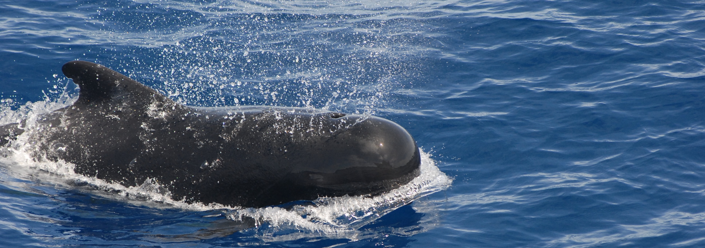

```{python}
#| label: setup
#| include: false
import pandas as pd
from plotnine import ggplot, aes, geom_point, geom_smooth, scale_y_log10, scale_x_log10, theme_minimal, labs
from plotnine.data import msleep
from IPython.display import display, Markdown
```

# Introduction to the Mammalian Sleep Dataset

This report describes `msleep`, a data set of 83 mammals, including their body weight, brain size, total hours of sleep, and number of REM cycles.


